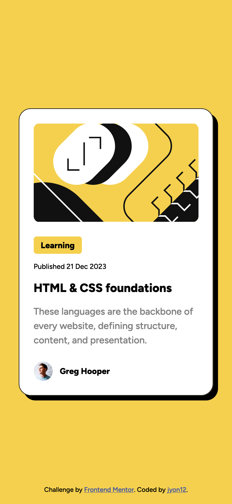

# Frontend Mentor - Blog preview card solution

This is a solution to the [Blog preview card challenge on Frontend Mentor](https://www.frontendmentor.io/challenges/blog-preview-card-ckPaj01IcS). Frontend Mentor challenges help you improve your coding skills by building realistic projects.

## Overview

### The challenge

Users should be able to:

- See hover and focus states for all interactive elements on the page

### Screenshot

### Links

- Solution URL: [Frontend Mentor](https://www.frontendmentor.io/solutions/blog-preview-card-t2eMRqNPNA)
- Live Site URL: [Live](https://jlyon12.github.io/blog-preview-card/)

## My process

### Built with

- Semantic HTML5 markup
- CSS3

## Author

- Frontend Mentor - [@jlyon12](https://www.frontendmentor.io/profile/jlyon12)
